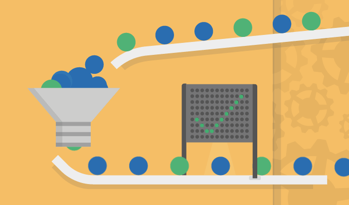

 
  <h2 ><b> Hi 👋, I'm Phạm Anh Đức (aka Total650) </b> </h2>
   
  
An Automation Tester passionate about Software Quality and Continuous Improvement

---

### About Me

- 🔭 **Currently Exploring**: API & Performance Testing to expand my skill set and push my boundaries in software quality assurance.
- 🌱 **Projects Completed**: Ranging from manual testing to full-fledged automation solutions across web and mobile platforms.
- 💬 **Ask Me About**: Java, Selenium, Appium, and Automation Testing best practices.
- 📫 **Contact Me**: duc.total650@gmail.com

---

### Connect with Me:

 

---

### 🛠️ Languages and Tools:

- **Automation Tools**: Selenium, Appium, RestAssured
- **Programming Languages**: Java, Python
- **Databases**: MySQL, PostgreSQL
- **Version Control**: Git

---

### 📂 Personal Projects:

- **Mobile App Automation**: Developed an automated test solution for an Android app using Appium, implementing the BDD approach to streamline testing and improve collaboration.
  
- **Web Application**: Created a simple yet functional web application using Java Spring Boot and Bootstrap 4, gaining deeper insights into web development and its impact on automation testing.

---

### Keep Surfing 🌊
